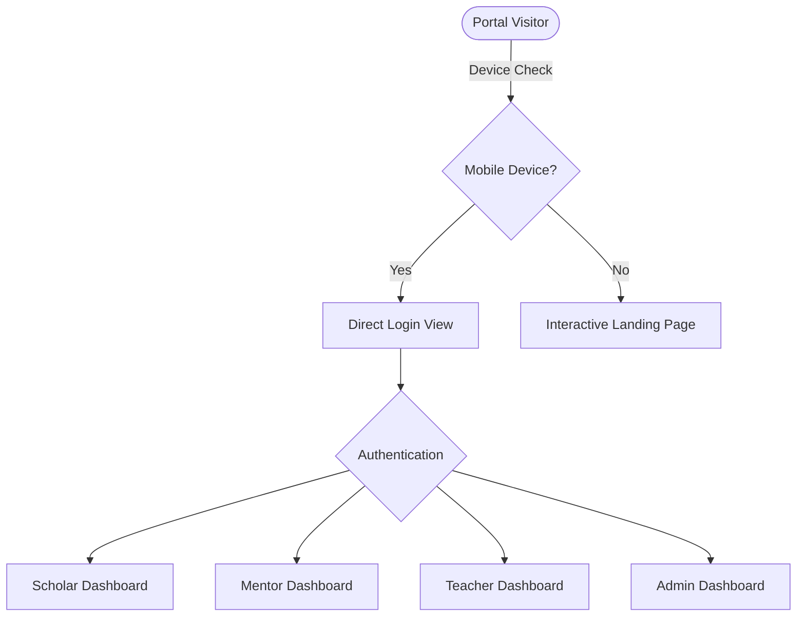

# Generation Rise Portal - Client Demo & User Guide

Welcome to the **Generation Rise Portal**, a premium, responsive full-stack ecosystem designed to support gender equity and empower the next generation of female leaders in Rwanda. This platform bridges the gap between scholars, mentors, teachers, and system administrators through an integrated suite of features.

---

## 🌟 Platform Overview
The Generation Rise Portal is built to impress clients with its rich aesthetics, smooth animations, and role-based permissions. It scales from a public-facing website into a unified, authenticated operations hub.

---

## 🔑 Role-Based Experiences & Features

### 1. The Scholar (Student) Workspace
Designed to be engaging, encouraging, and easy to navigate for scholars on any device.

* **Interactive Curriculum Catalog:** 
  - Scholars can browse learning modules organized across four core pillars: *Career Readiness*, *Entrepreneurship*, *Professional English*, and *Life Skills*.
  - **Sequential Unlocking:** Modules unlock in a strict sequence (e.g., Lesson 2 only becomes accessible once Lesson 1 is completed/submitted), keeping study paths organized.
  - Hover tooltips explain exactly which preceding module needs to be finished to unlock the next card.
* **Lecture Study Desk:** 
  - Dynamic video player featuring video lecture playback.
  - **Interactive Checklist:** Tracks progress across three states (*Watch Video*, *Read Reference Document*, *Complete Short Quiz*). Checklists are saved persistently in browser storage.
  - **Auto-Check Progress:** Watching a video past 90% progress automatically checks the "Watch Video" box for the scholar.
* **Homework Submissions:**
  - Submit documents, PDF templates, or PNG images (up to 5MB) for grading.
* **QR Attendance & Study Streak Tracker:**
  - Simulates scanning a classroom QR code to log daily attendance.
  - Features an active streak counter that grows with daily check-ins to build study habits.
* **Direct Mentor Chat:**
  - Real-time chat channel with assigned mentors for guidance.

---

### 2. The Mentor Workspace
Enables mentors to evaluate work, track performance, and maintain contact with their assigned scholars.

* **Grading Desk:** 
  - Mentors can view all pending homework submissions, open/preview documents, assign scores (0-100), and write constructive remarks.
* **Scholar Roster Tracker:** 
  - Trace scholar completion logs, streak numbers, and attendance ratios in a detailed tabular view.
* **Direct Messages (DMs):** 
  - Direct communication interface with scholars.

---

### 3. The Teacher Workspace
Empowers curriculum developers and program directors to configure learning materials.

* **Curriculum Management Suite:**
  - Create, modify, or delete course lessons.
  - **Rich Text Notes Editor:** Build detailed study guides with formatting (headers, bold, lists, and links) and view a live preview before publishing.
  - **Lesson Cover Photos:** Upload lesson backdrops or paste image URLs to customize the lecture player splash screens.
  - **Resource Attachments:** Upload files and worksheets directly to lessons.
* **Cohort Administration:**
  - Trace simple Cohorts (Cohort 1 through Cohort 4) to monitor enrollment metrics and average attendance.
* **Broadcast Board:**
  - Post urgent bulletins, extend deadlines, and announce announcements visible on all user dashboards.

---

### 4. The Administrator Console
Offers full administrative control over the platform's security and directory configurations.

* **User Directory CRUD:**
  - Complete user management directory to add, edit, or delete accounts across all roles (Scholars, Mentors, Teachers, Admins).
* **Database Operations (System Config):**
  - **One-Click Reset:** Reset the SQLite database to its default seed state (syncing tables and restoring initial demo courses/accounts) in a single click.
  - **Security Panel:** Toggle mock SSL Sandboxing or enforce weekly NGO Compliance logging variables on the fly.

---

## 🤖 Dynamic AI Chatbot Assistant
Visible to all logged-in users, the chatbot floats at the bottom-right of the portal and adapts contextually to the user's role.

> [!TIP]
> The chatbot runs **locally and securely** on your hosted backend with 0ms network latency. It does not require external billing, setup, or third-party API keys.

* **Scholar Mode:** Welcomes the scholar by name and offers quick questions about task submissions, logging attendance, and streak points.
* **Mentor Mode:** Offers suggestions regarding evaluation logs, scholar checklist trackers, and chat rooms.
* **Teacher Mode:** Directs the teacher on configuring lessons, managing simple cohorts, and sending broadcasts.
* **Admin Mode:** Suggests quick actions for database resets, user directory additions, and compliance settings.

---

## 📱 Mobile-First Optimizations
The entire portal is optimized for mobile-first workflows:
* **Smart Mobile Bypass:** Hitting the site on a mobile device immediately bypasses the landing page to load the login screen directly, helping scholars access their dashboard quickly on the go.
* **Responsive Spacing:** Floating widgets (like the AI Chatbot) automatically shift positions (`bottom-[88px]` instead of `bottom-6`) on mobile viewports to hover cleanly above the bottom navigation row without overlapping.
